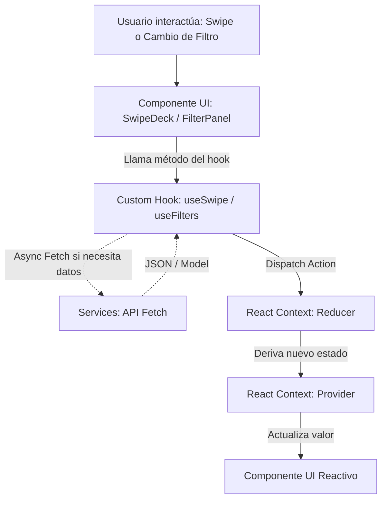

# CineSwipe - Arquitectura de la Aplicación

## 1. Estructura de Directorios (Árbol de Carpetas)

```text
src/
├── components/          # 1er nivel
│   ├── ui/              # 2do nivel (Ej. Button, Spinner)
│   └── swipe/           # 2do nivel (Ej. MovieCard, SwipeDeck)
├── context/
│   ├── movies/          # Estado de películas (Context + Reducer)
│   └── filters/         # Estado de búsqueda por género/año
├── hooks/
│   ├── useMovies.ts     # Lógica de carga y paginación
│   └── useSwipe.ts      # Lógica de gestos (like/dislike)
├── pages/
│   ├── Home/            # Landing page
│   └── Discovery/       # Vista principal de swipe
├── services/
│   ├── api.ts           # Llamadas a la API (Ej. TMDB)
│   └── mappers.ts       # Transformación de datos de API a dominio
├── types/
│   └── index.ts         # Tipos e interfaces globales
└── utils/
    ├── helpers.ts       # Funciones puras reutilizables
    └── constants.ts     # Constantes, endpoints de API
```

## 2. Módulos y Responsabilidades

| Módulo | Responsabilidad | Archivos Clave |
|--------|-----------------|----------------|
| `components` | Presentación visual y componentes "tontos" (dumb components). Reciben props y emiten eventos, sin gestionar estado global. | `MovieCard.tsx`, `SwipeDeck.tsx`, `Button.tsx` |
| `context` | Gestión del estado global mediante `React.createContext` y `useReducer`. Evita prop-drilling en la aplicación. | `MoviesContext.tsx`, `filtersReducer.ts` |
| `hooks` | Lógica de negocio de UI pura. Orquestan llamadas a servicios y despachan acciones al Context. Mantienen los componentes limpios. | `useMovies.ts`, `useSwipe.ts`, `useFilters.ts` |
| `pages` | Vistas principales (Smart components). Ensamblan los componentes visuales y consumen los hooks para brindar datos. | `Home.tsx`, `Discovery.tsx` |
| `services` | Interacción exclusiva con agentes externos (APIs). No saben nada de React. | `api.ts`, `mappers.ts` |
| `types` | Definiciones estrictas de los modelos de datos y props usando TypeScript. | `index.ts` (Movie, FilterParams) |
| `utils` | Utilidades independientes y repetitivas genéricas. | `constants.ts`, `helpers.ts` |

## 3. Flujo de Datos (Mermaid)

El flujo de datos sigue un modelo unidireccional y predecible, basado en acciones y reducers dentro del Contexto, interactuando con los hooks para los side-effects.



## Convenciones de Naming

- **Carpetas**: `kebab-case` para servicios/utils, `PascalCase` para componentes y páginas.
- **Componentes**: `PascalCase` (Ej. `MovieCard.tsx`).
- **Hooks**: Funciones en `camelCase` empezando con `use` (Ej. `useSwipe.ts`).
- **Tipos/Interfaces**: `PascalCase` (Ej. `IMovie`, `FilterState`).
- **Constantes**: `UPPER_SNAKE_CASE` (Ej. `MAX_SWIPE_HISTORY`).
